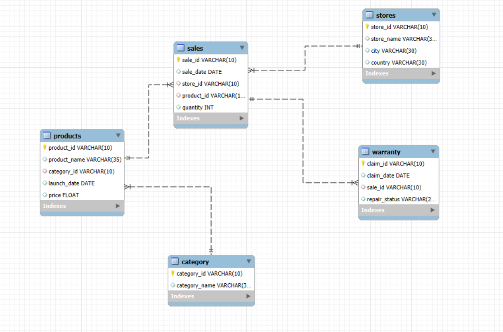

#  Apple Retail Sales SQL Project
**Analyzing Millions of Sales Rows Using Advanced SQL Queries**

---

## 📖 Project Overview
This project demonstrates advanced SQL querying techniques on over 1 million rows of Apple Retail Sales data. The dataset includes products, stores, sales transactions, and warranty claims across Apple retail locations worldwide.  

By tackling questions from basic to complex, this project showcases the ability to write sophisticated SQL queries that extract valuable insights from large datasets. It’s ideal for data analysts looking to enhance SQL skills using real-world business data.

---

## 🗂 Entity Relationship Diagram (ERD)
The project database uses five main tables:

---

## 📊 Database Schema

### 1. Stores
- `store_id` : Unique identifier  
- `store_name` : Name of the store  
- `city` : City where the store is located  
- `country` : Country  

### 2. Category
- `category_id` : Unique identifier  
- `category_name` : Name of the category  

### 3. Products
- `product_id` : Unique identifier  
- `product_name` : Name of the product  
- `category_id` : References `category`  
- `launch_date` : Product launch date  
- `price` : Product price  

### 4. Sales
- `sale_id` : Unique identifier  
- `sale_date` : Date of sale  
- `store_id` : References `stores`  
- `product_id` : References `products`  
- `quantity` : Number of units sold  

### 5. Warranty
- `claim_id` : Unique identifier  
- `claim_date` : Date of claim  
- `sale_id` : References `sales`  
- `repair_status` : Status of warranty claim (e.g., Paid Repaired, Warranty Void)  

---

## 🎯 Project Objectives
The project includes questions of increasing complexity:  

**Easy to Medium (10 Questions)**  
- Number of stores per country  
- Total units sold per store  
- Sales in December 2023  
- Stores with no warranty claims  
- Percentage of "Warranty Void" claims  
- Highest selling store last year  
- Count unique products sold last year  
- Average product price per category  
- Warranty claims filed in 2020  
- Best-selling day for each store  

**Medium to Hard (5 Questions)**  
- Least selling products per country/year  
- Warranty claims within 180 days of sale  
- Claims for products launched in the last 2 years  
- Months with sales >5,000 units in the USA  
- Category with most warranty claims in last 2 years  

**Complex (5 Questions)**  
- Percentage chance of warranty claims per country  
- Yearly growth ratio per store  
- Correlation between product price and warranty claims  
- Store with highest % of "Paid Repaired" claims  
- Monthly running total of sales per store over 4 years  

---

## 🔍 Project Focus
- **Complex Joins & Aggregations** – extract meaningful insights  
- **Window Functions** – running totals, growth, and time-based queries  
- **Data Segmentation** – analyze performance over time and categories  
- **Correlation Analysis** – relationships between product price and warranty claims  
- **Real-World Problem Solving** – practical business-related SQL queries  

---

## 📂 Dataset
- **Size**: 1 million+ rows  
- **Period Covered**: Multiple years for trend analysis  
- **Geographical Coverage**: Apple stores worldwide  

